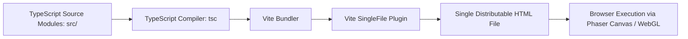

# tetromino-block-puzzle

High-performance 2D spatial puzzle game engine implemented in TypeScript using Phaser and Vite.

## Overview

Tetromino Block Puzzle is an interactive browser-based spatial puzzle game. It renders dynamic grid-based polyomino placement mechanics, line-clearing logic, and combo multipliers using the Phaser 4 rendering engine. The project features single-file HTML bundle compilation for zero-dependency local or web distribution.

## Architecture and Pipeline

The application compiles from modular TypeScript sources into an optimized standalone browser bundle.



- Game Core: Grid logic, piece validation, collision detection, and score evaluation implemented in strongly typed TypeScript.
- Graphics Engine: High-performance 2D WebGL/Canvas rendering via Phaser.
- Distribution Pipeline: `vite-plugin-singlefile` inlines CSS, scripts, and base64 audio/graphics assets into a portable single-file build (`build:clean`).

## Tech Stack

| Component | Technology | Description |
| :--- | :--- | :--- |
| Runtime | Node.js 18+, Modern Web Browser | Development and client execution environments |
| Language | TypeScript 5+ | Strongly-typed gameplay and matrix math |
| Rendering Engine | Phaser 4.x | WebGL / Canvas 2D scene and input management |
| Build Tool | Vite 6+, vite-plugin-singlefile | Bundling and single-file HTML compilation |

## Project Structure

```text
Tetrimono_block_puzzle/
├── .gitignore            # Git exclusion filters
├── README.md             # Technical documentation
├── index.html            # Application HTML shell
├── package.json          # Node dependency and script definitions
├── tsconfig.json         # TypeScript compiler options
├── vite.config.ts        # Vite build and plugin configuration
├── build_clean.js        # Single-file post-build optimization script
├── public/               # Static audio, sprites, and fonts
└── src/                  # Game scenes, managers, and grid logic
```

## Setup and Prerequisites

### Prerequisites
- Node.js 18 or higher
- npm (bundled with Node.js)

### Installation

1. Clone repository:
   ```bash
   git clone https://github.com/Gehrman-Sparrow42/Tetrimono_block_puzzle.git
   cd Tetrimono_block_puzzle
   ```

2. Install dependencies:
   ```bash
   npm install
   ```

## Usage Examples

### Development Server
Run the local hot-reloading development server:
```bash
npm run dev
```
Open your browser at the displayed local URL (typically `http://localhost:5173`).

### Production Build
Compile the single-file distribution bundle:
```bash
npm run build:clean
```
The output will be placed in `dist/index.html`.

## Notes and Constraints

- Performance: WebGL is enabled by default with automatic Canvas fallback for devices lacking hardware acceleration.
- Single-File Size: Inlining assets into a single file simplifies distribution but increases initial download payload slightly relative to chunked assets.
